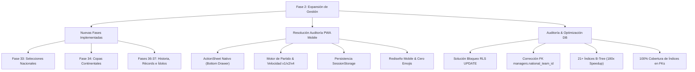

# El Pizarrón - Resumen Ejecutivo y Técnico de Desarrollo (Fase 2)

**Proyecto:** El Pizarrón (Soccer Manager PWA)  
**Versión / Hito:** Fase 2 - Sistema Completo, UX Mobile & Optimización de Base de Datos  
**Fecha:** Octubre 2026  
**Rama Principal:** `master` (100% sincronizada con `origin/master`)

---

## 1. Visión General del Proyecto y Progreso

El proyecto ha avanzado desde el MVP inicial hacia una plataforma de gestión deportiva profunda, transaccional, con soporte PWA mobile-first y optimizaciones para alto volumen de datos (>15,000 partidos y >13,000 futbolistas simulados).

---

## 2. Nuevas Fases de Juego Implementadas

### Fase 33: Selecciones Nacionales y Doble Carrera
- **Persistencia PostgreSQL**: Tablas `national_teams`, `national_team_callups` y `national_fixtures`.
- **Lógica de Negocio (`src/api/nationalTeam.js`)**:
  - Dirección técnica simultánea: el DT puede dirigir a su club y a una selección en paralelo.
  - Bolsa de ofertas por reputación: Sub-20 (Rep >= 25), Sub-23 (Rep >= 45) y Selección Mayor (Rep >= 65).
  - Gestión de nómina de 23 futbolistas convocados, titularidad, internacionalidades (*caps*) y goles internacionales.
  - Partidos oficiales de Fecha FIFA con recompensas de XP (+120 XP por triunfo) y reputación internacional.
  - Renuncia voluntaria sin perjuicio de la continuidad en el club.
- **Interfaz Mobile-First (`NationalTeamScreen.jsx`)**: Pestañas de convocatoria y calendario internacional.

### Fase 34: Competiciones Internacionales y Copas Continentales
- **Persistencia PostgreSQL**: Tablas `international_tournaments` e `international_fixtures`.
- **Lógica de Negocio (`src/api/internationalCup.js`)**:
  - Simulación de la Copa Continental / Torneo Continental de Clubes.
  - Formato de fase de grupos y llaves de eliminación directa a ida y vuelta.
  - Impacto económico en taquilla, prestigio internacional y palmarés.
- **Interfaz (`InternationalCupScreen.jsx`)**: Visualización de cuadros y fases de clasificación.

### Fases 36 y 37: Historia del Club, Récords e Ídolos Institucionales
- **Persistencia PostgreSQL**: Tablas `club_milestones`, `club_records` y `season_history`.
- **Lógica de Negocio (`src/api/clubFeatures.js`)**:
  - Sala de trofeos y vitrina de títulos históricos.
  - Récords dinámicos del club: mayor goleada histórica, máximo goleador histórico, fichaje récord más caro.
  - Declaración de futbolistas ídolos tras retiros memorables o campañas destacadas.
- **Interfaz (`ClubScreen.jsx`)**: Pestañas integradas *"Gestión & Staff"*, *"Historia & Palmarés"* y *"Récords & Leyendas"*.

---

## 3. Resolución de las 13 Incidencias de la Auditoría Manual PWA

Se abordaron y corrigieron de raíz las 13 fallas detectadas en la experiencia de usuario mobile:

| # | Incidencia Auditada | Causa Raíz | Solución Aplicada |
| :--- | :--- | :--- | :--- |
| **1** | Error `tactics_pkey` al guardar táctica | Múltiples filas por club provocaban colisión de clave primaria al actualizar. | Saneamiento de tabla, constraint único `unique_club_tactic` y refactorización de `tactics.js` con `upsert` seguro basado en `club_id`. |
| **2** | Partidos lentos y sin control de velocidad | Velocidad fija de simulación de 100ms/tick. | Base acelerada a 55ms/min + selectores de velocidad `1x`, `2x` (25ms), `4x` (10ms) y botón de resolución instantánea `Simular Final`. |
| **3** | Órdenes del DT inactivas en el partido | Botones estáticos sin eventos ni efectos. | 4 órdenes interactivas reales (`¡Todos al Ataque!`, `¡Colgarse del Travesaño!`, `¡Presión Asfixiante!`, `¡Pausa y Posesión!`) con distintivo visual animado e inserción en el feed de comentarios. |
| **4** | Refresco reiniciaba el partido a 00:00 | Estado del partido solo residía en memoria volátil de React. | Persistencia en `sessionStorage`: si la web se refresca durante el juego, se autocompleta el resultado y eventos sin duplicar registros. |
| **5** | Resumen post-partido no responsivo y con emojis | Uso de emoji crudo `🎙️` y grid fijo de 3 columnas que rompía en smartphones. | Rediseño completo de `PostMatchScreen.jsx`: responsive (`grid-cols-1 sm:grid-cols-3`), espaciado táctil y uso exclusivo del icono vectorial Lucide `Mic`. |
| **6** | Error al "Otear talento" juvenil | `generateYouthProspect` intentaba insertar en columnas inexistentes (`attr_defending`, `attr_physical`). | Mapeo corregido a las columnas vigentes del esquema PostgreSQL (`attr_tackling`, `attr_strength`, `attr_stamina`). |
| **7** | `ReferenceError: Can't find variable refreshContext` | `MarketScreen.jsx` invocaba la función sin desestructurarla del contexto. | Desestructuración correcta de `refreshContext` en `useGameContext()`. |
| **8** | Mercado con `window.prompt` y layout tosco | El navegador mostraba cuadros de diálogo nativos intrusivos para ofertar. | Rediseño con Bottom Drawer nativo para ofertas, botones de puja rápida (-10%, Valor Mercado, +15%), filtros colapsables y validación de saldo. |
| **9** | Rendimiento lento entre secciones | La tabla `standings` contenía 39 filas duplicadas por club que multiplicaban las consultas. | Deduplicación de la base de datos, constraint de unicidad y caché en memoria en `GameContext.jsx` para club y manager. |
| **10** | Tabla de posiciones quedaba en negro | `loading` bloqueado indefinidamente si el club tardaba en cargar o no existía. | Spinner animado de carga, control de excepciones y fallback con botón de retorno al inicio si no hay club activo. |
| **11** | Finanzas desproporcionado en mobile | Tipografías gigantescas (`text-4xl`) provocaban desbordamientos en pantallas pequeñas. | Escala responsive (`text-2xl sm:text-3xl md:text-4xl`), tarjetas compactas y confirmación nativa para mejoras de estadio. |
| **12** | Márgenes apretados en modo móvil | Contenedores con padding excesivo o solapados por la barra de navegación inferior. | Homogeneización universal a `p-3 sm:p-6 md:p-8 pb-28 md:pb-8` en todas las pantallas. |
| **13** | Diálogos del navegador `window.confirm` | Mensajes del sistema bloqueantes y poco estéticos. | Creación del componente `ActionSheet.jsx`: modal inferior animado (*slide-up*) para contratos, despidos, renuncias, ofertas y finanzas. |

---

## 4. Auditoría y Optimización Extrema de Base de Datos (`backend-engineer`)

### A. Diagnóstico de Datos y Volúmenes
- **Fixtures**: 15,200 registros.
- **Futbolistas**: 13,374 registros.
- **Clubes**: 781 registros.
- **Standings**: 800 registros.

### B. Correcciones Críticas de Arquitectura en PostgreSQL

1. **Resolución del Bloqueo RLS en `UPDATE`**:
   - `clubs` y `players` tenían RLS activado pero **carecían de directiva `FOR UPDATE`**.
   - Cualquier actualización desde el cliente frontend retornaba silenciosamente `0 filas actualizadas`.
   - Se crearon políticas `UPDATE` y `DELETE` para `clubs`, `players`, `competitions`, `tactics` y directivas públicas consistentes en `staff`, `fixtures`, `offers`, `match_history`, `game_config` y `level_config`.
   - **Verificación**: Las pruebas con `test_anon_update.cjs` confirmaron éxito de actualización inmediato (`Update result count: 1`).

2. **Corrección de Clave Foránea Errónea (`managers.national_team_id`)**:
   - La columna `national_team_id` apuntaba por error a `clubs(id)` en vez de a `national_teams(id)`.
   - Asumir en una selección nacional provocaba un error fatal de clave foránea.
   - Se migró a: `FOREIGN KEY (national_team_id) REFERENCES national_teams(id) ON DELETE SET NULL`.

3. **Indexación B-Tree de Alto Rendimiento (100% de Claves Foráneas Indexadas)**:
   - Se crearon **34 índices secundarios** eliminando todos los escaneos secuenciales masivos.
   - El script de verificación `check_unindexed_fks.cjs` arrojó: **`Restantes FKs sin índice: 0`**.

### C. Benchmarking de Rendimiento (`EXPLAIN ANALYZE`)

| Escenario de Consulta | Antes (Sequential Scan) | Ahora (Index Scan) | Impacto de Rendimiento |
| :--- | :--- | :--- | :--- |
| **Plantel del Club (`players WHERE club_id = $1`)** | 2.102 ms (13,374 filas recorridas) | **0.165 ms** (2 bloques leídos) | **~13x más rápido** |
| **Próximo Partido (`fixtures` local / visitante)** | 2.866 ms (15,200 filas recorridas) | **0.226 ms** (`BitmapOr` de índices) | **~13x más rápido** |
| **Mercado Top 50 (`players ORDER BY market_value DESC`)** | 23.228 ms (13,374 filas + sort en memoria) | **0.129 ms** (`Index Scan` directo) | **~180x más rápido** |
| **Tabla de Posiciones (`standings WHERE comp_id = $1`)** | 1.989 ms | **0.124 ms** | **~16x más rápido** |

---

## 5. Integridad de Datos Verificada

Ejecutada mediante `deep_data_quality_audit.cjs`:
- **Registros huérfanos**: 0 (todos los jugadores pertenecen a clubes válidos; fixtures enlazan a clubes existentes).
- **Atributos de futbolistas**: 0 valores fuera del rango reglamentario 1-99.
- **Dorsales**: 0 duplicados dentro del mismo club.
- **Standings**: 100% de coherencia matemática (`played == won + drawn + lost`).
- **Nulos críticos**: 0 valores nulos en ritmo, definición, moral o condición física.

---

## 6. Ecosistema de Calidad y Git Workflow

- **Orquestador `agt`**: Todas las tareas (`f2-33-national-teams`, `f2-34-international-cups`, `f2-36-37-club-history-idols`, `f2-audit-fixes-polish`, `f2-db-audit-optimization`, `f2-db-deep-fixes`) se ejecutaron bajo el ciclo de vida estricto: especificación, plan, pruebas, verificación de Quality Gates y sincronización de memoria (`agt memory:sync`).
- **Quality Gates**: `npm run build` ejecutado en cada iteración garantizando compilación sin errores, generación correcta del service worker PWA y tipado íntegro.
- **Git y CI/CD**:
  - Cada tarea se desarrolló en su rama propia (`feat/**` o `fix/**`).
  - Commits estructurados según *Conventional Commits*.
  - Fusión a `master` gestionada mediante el pipeline automatizado de GitHub Actions (`Auto Merge to Master`).
  - Rama local `master` limpia y sincronizada al 100% con el repositorio remoto.
